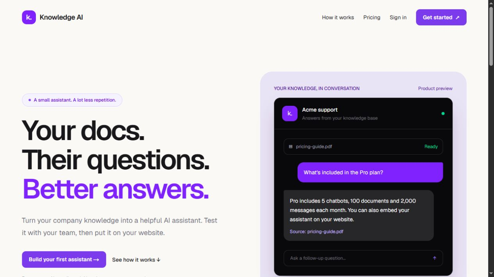
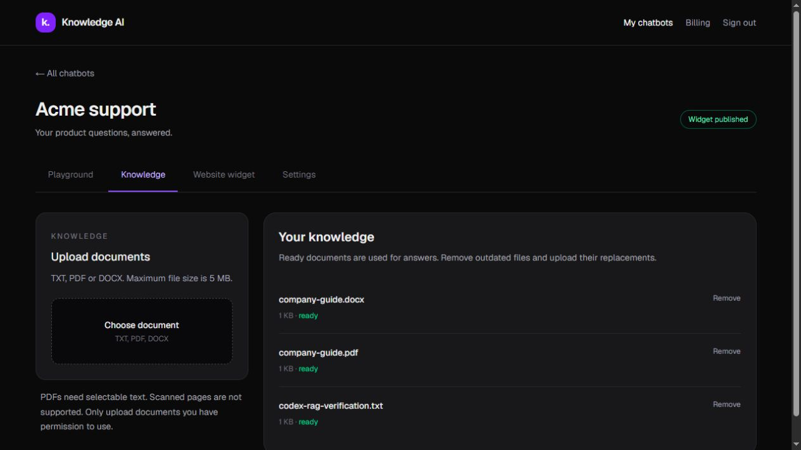
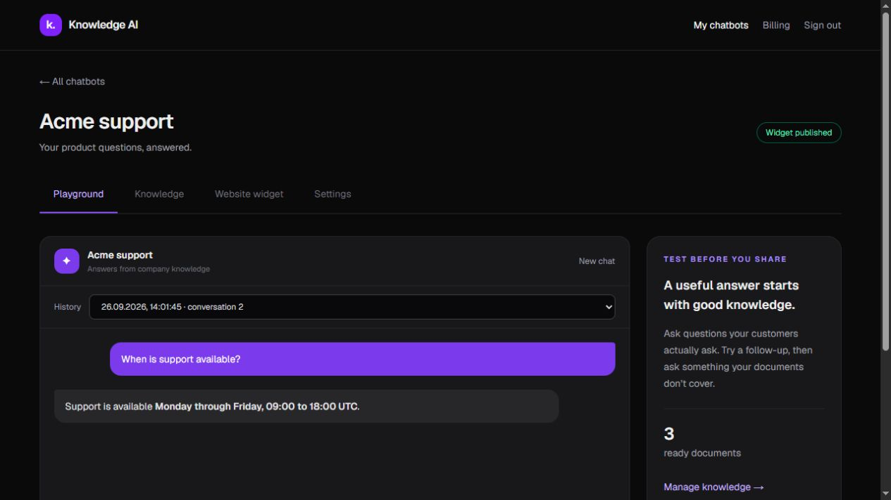
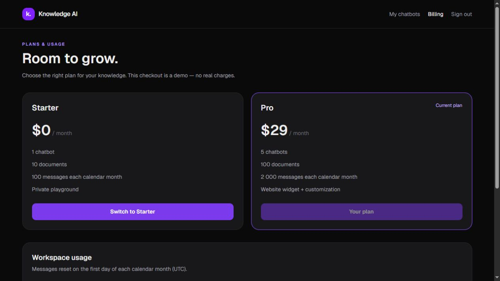
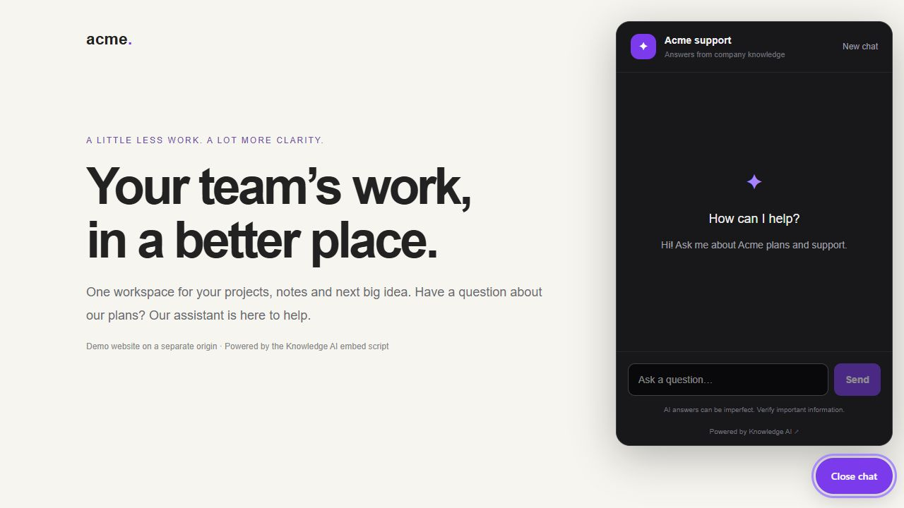

# Knowledge AI — product walkthrough

**A company-knowledge assistant for small teams that answer the same product questions every day.**

Knowledge AI turns company documents into an assistant you can test privately and publish on a website. This walkthrough demonstrates the Paralect Chatbot Builder MVP. Billing is simulated throughout; no card details or money are involved.

## 1. Discover the product

The landing page explains the problem, shows the assistant, describes the three-step setup and presents two plans. Start with Starter at $0, then use the $29/month Pro demo when you want to publish a widget.

## 2. Create an assistant and add knowledge

Create an account, sign in and choose **Create chatbot**. Give the bot a name and a short description. In **Knowledge**, upload a TXT, PDF or DOCX file, up to 5 MB. PDFs need selectable text. The status changes to **ready** when its text has been indexed.

For a reproducible demo, use `sample-knowledge.txt`, supplied with this walkthrough. It contains the Acme Pro price and support hours. The screenshot also shows that PDF and DOCX files can be processed.

## 3. Test real questions

Open **Playground** and ask:

- “How much does the Pro plan cost?” — the answer should be $29 per user per month.
- “Is that per user?” — the assistant can use the conversation to understand this follow-up.
- “When is support available?” — Monday through Friday, 09:00–18:00 UTC.
- “Who is the CEO?” — the uploaded sample does not say; the assistant should acknowledge that it does not know based on the uploaded knowledge.

New answers show the source document names. Refresh the page to restore the latest conversation, choose an earlier conversation in **History**, or choose **New chat** to start again.

## 4. Try the business model

Open **Billing**, choose **Try Pro — demo checkout**, review the explicitly simulated order and select **Simulate successful payment**. The account switches to Pro and records a simulated payment. Refreshing the page keeps that plan.

| | Starter | Pro |
| --- | --- | --- |
| Proposed monthly price | $0 | $29 |
| Chatbots | 1 | 5 |
| Documents across the workspace | 10 | 100 |
| Messages per calendar month | 100 | 2,000 |
| Private playground and chat history | Yes | Yes |
| Website widget | No | Yes |

The server enforces the plan limits. Switching back to Starter pauses public widgets. If the workspace exceeds Starter’s bot/document allowance, it explains what must be removed before downgrading; it never silently deletes knowledge.

## 5. Put it on a website

In the bot’s **Website widget** tab, customize the welcome message and accent color. Enable **Publish this assistant** only for knowledge you intend visitors to access, then save. Copy the embed snippet and paste it before the closing `</body>` tag of your website.

Open the built-in sample website preview to test the chat launcher. Visitors do not need an account. Their conversation has its own signed session and cannot access another visitor’s or the owner’s chat history. Pausing the widget or downgrading the plan disables public questions.

## 6. Keep the knowledge useful

Use **Settings** to update the assistant’s name, description and tone. Knowledge-grounding rules still apply. Remove outdated documents in **Knowledge**, then upload their replacements. Removing a document deletes its file and searchable chunks; previous chat messages remain until the chatbot is deleted. Deleting a chatbot requires entering its name and removes its knowledge and conversations.

## What was checked

- Production build, lint and 20 automated tests.
- Actual TXT, PDF and DOCX ingestion with stored embeddings.
- Grounded answers, unknown-answer fallback, follow-up context and persisted history.
- Pro activation, duplicate checkout handling, downgrade and server-side limits.
- Public widget, signed visitor sessions, owner/visitor separation and direct database isolation.
- Desktop and mobile interface checks.

This is a focused evaluation MVP. Payments are mocked, scans need OCR outside this scope, and AI answers still need verification for important decisions. Render’s free service may take time to wake after inactivity.
